# LLM Routing POC — Architecture and User Guide

**Version:** 1.0 (`d49e1a6`)
**Component:** Cost-aware model routing for an IT Operations assistant
**Audience:** engineers, reviewers, and anyone opening the dashboard for the first time

---

## Contents

1. [What this system is](#1-what-this-system-is)
2. [The problem it addresses](#2-the-problem-it-addresses)
3. [Use cases](#3-use-cases)
4. [System architecture](#4-system-architecture)
5. [The request pipeline](#5-the-request-pipeline)
6. [The three routing strategies](#6-the-three-routing-strategies)
7. [Cost and quality measurement](#7-cost-and-quality-measurement)
8. [The batch experiment](#8-the-batch-experiment)
9. [The dashboard, tab by tab](#9-the-dashboard-tab-by-tab)
10. [Data model](#10-data-model)
11. [API reference](#11-api-reference)
12. [Configuration](#12-configuration)
13. [Deployment](#13-deployment)
14. [Testing](#14-testing)
15. [Measured results](#15-measured-results)
16. [Known limitations](#16-known-limitations)

> **Diagrams.** Every diagram below is [Mermaid](https://mermaid.js.org/), which GitHub renders
> natively in this page. To edit one visually, open [draw.io](https://app.diagrams.net) and choose
> **Arrange → Insert → Advanced → Mermaid**, then paste the code from the block.

---

## 1. What this system is

A working proof of concept that answers one question with evidence rather than assertion:

> **Does routing each request to the cheapest model that can handle it save money without costing
> quality?**

It is a simulated **IT Operations assistant**. It answers questions about a fixed set of telemetry
(logs, metrics, incidents) describing a database incident cascading through a payment system. A
routing service picks which language model answers each question, and an LLM judge grades every
answer against a known-correct one.

The objective is stated in the product itself:

> The objective isn't to always use the cheapest model. It's to use the cheapest model that can
> satisfy the requirements of the request.

**What makes it more than a demo:** three routing strategies are run over the *same* questions with
the *same* context, and every answer is graded. Cost savings are never claimed without a quality
number beside them.

---

## 2. The problem it addresses

Most teams send every request to their best model. That is the safe default and it is expensive,
because a large share of real traffic is simple lookups that a much cheaper model answers perfectly.

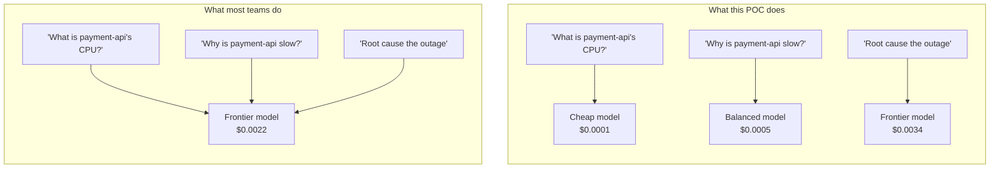

The difficulty is that "cheapest that can handle it" is a claim you have to prove. Without grading,
routing to a cheaper model always looks like a saving — you simply stop seeing the quality you lost.
That is why the judge is not an optional extra here; it is what makes the cost number meaningful.

---

## 3. Use cases

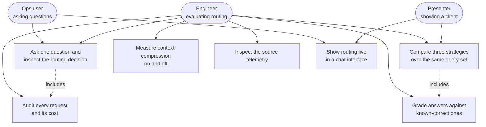

| Actor | Goal | Where in the UI |
|---|---|---|
| Ops user | Get an answer about the current incident | Query console, Chat demo |
| Engineer | Decide whether routing is worth shipping | Experiment results |
| Engineer | Check what a request actually cost | Request log |
| Engineer | Verify the assistant is grounded in real data | Telemetry data |
| Presenter | Show a client the same question landing on different models | Chat demo |

---

## 4. System architecture

A single FastAPI process serving both the API and a no-build-step HTML dashboard.

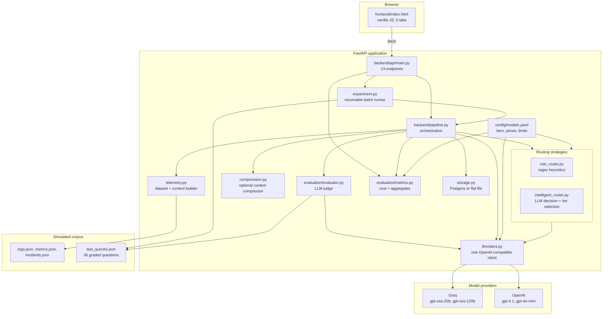

### Why it is shaped this way

**One client for every provider.** Groq and OpenAI both speak the OpenAI `/chat/completions`
dialect, so `llm/client.py` covers both. Only the auth header and a few request fields differ. Adding
a third provider is configuration, not code.

**Prices live in one YAML file.** `config/models.yaml` holds model ids, providers, prices, latency
ceilings and context limits. Swapping a model never touches application code.

**Storage is swappable behind one async interface.** A flat JSON file locally, Postgres when
`DATABASE_URL` is set. This is what lets the same code run on a serverless host with a read-only
filesystem.

---

## 5. The request pipeline

Every question — from the console, the chat tab, or the batch runner — takes the same path.

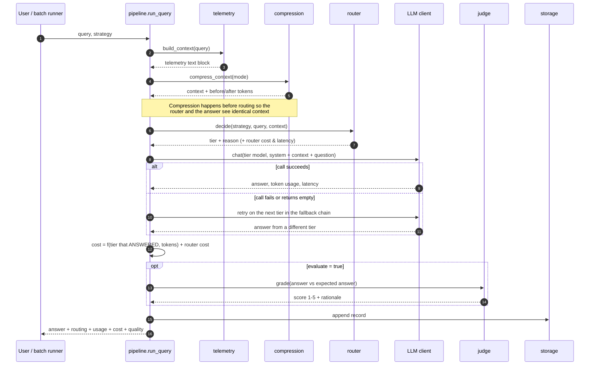

### Two details that matter

**Cost is attributed to the tier that actually answered, not the tier the router picked.** If the
cheap model fails and the premium model answers, the request is billed at premium rates. The record
keeps both `routed_tier` and `tier` so an auditor can see the difference. Most routing demos get this
wrong and understate real spend.

**The fallback chain escalates before it descends.** From the routed tier it tries more capable tiers
first (a costlier answer beats a missing one), then cheaper ones.

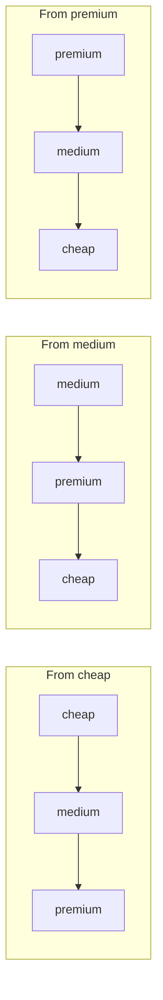

An **empty completion counts as a failure**, not an answer. The `gpt-oss` models are reasoning
models: left at their defaults they spend the whole completion budget on hidden reasoning and return
nothing. A blank answer must never reach the judge.

---

## 6. The three routing strategies

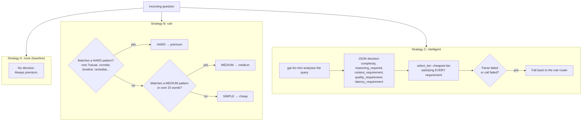

### Strategy A — `none` (baseline)

Every question goes to `gpt-4.1`. This exists to be the number the other two are measured against.
It is what a team does before they think about cost.

### Strategy B — `rule`

Deterministic regular expressions over the question text. Costs nothing and adds no latency.

| Band | Triggers | Tier |
|---|---|---|
| HARD | `root.?cause`, `correlat`, `timeline`, `remediat`, `blast radius`, `assess`, `prevent`, ... | premium |
| MEDIUM | `why`, `compare`, `related`, `pattern`, `affected`, `changed`, or more than 25 words | medium |
| SIMPLE | anything else | cheap |

It is fast and transparent, and it is brittle: it reads words, not meaning.

### Strategy C — `intelligent`

A small model (`gpt-4o-mini`) reads the question and returns a structured judgement. **The model does
not choose the tier.** It states requirements; code then picks the cheapest tier that satisfies all
of them:

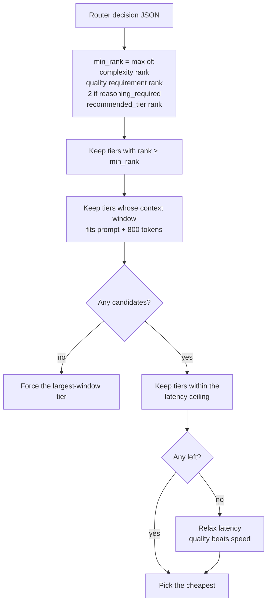

Latency ceilings map from the stated requirement: `HIGH → 3000ms`, `MEDIUM → 5000ms`, `LOW → no
limit`. If latency eliminates every capable tier the constraint is relaxed, because for an operations
assistant a correct slow answer beats a fast wrong one.

**The router costs real money**, and that cost is added to the request total. A routing strategy that
hides its own overhead is not measuring anything.

---

## 7. Cost and quality measurement

### Cost

```
cost = (input_tokens  ÷ 1,000,000) × input_price_per_1M
     + (output_tokens ÷ 1,000,000) × output_price_per_1M
     + router_cost                         (intelligent strategy only)
```

Token counts come from the provider's own `usage` block, not from an estimate. Prices come from
`models.yaml`. Every tier is a **real billed rate** — there is no free endpoint priced at a reference
rate, so no asterisk is needed on the comparison.

### Quality

An LLM judge (`gpt-4o-mini`) sees the question, the known-correct answer, the grading criteria and
the assistant's answer, then returns a 1–5 score with a one-sentence rationale.

| Score | Meaning |
|---|---|
| 5 | Correct and comprehensive |
| 4 | Correct, minor omissions |
| 3 | Partially correct; a key fact wrong or missing |
| 2 | Mostly incorrect |
| 1 | Incorrect or unsupported |

### The two headline numbers

```
cost_savings_pct     = (baseline_avg_cost − strategy_avg_cost) ÷ baseline_avg_cost × 100
quality_retention_pct = strategy_avg_quality ÷ baseline_avg_quality × 100
```

Both compare **averages per request**, not totals. If one strategy has a few more or fewer records
than another, comparing totals would flatter or penalise it for the wrong reason. A regression test
pins this.

---

## 8. The batch experiment

The experiment runs every selected question through all three strategies and grades every answer.

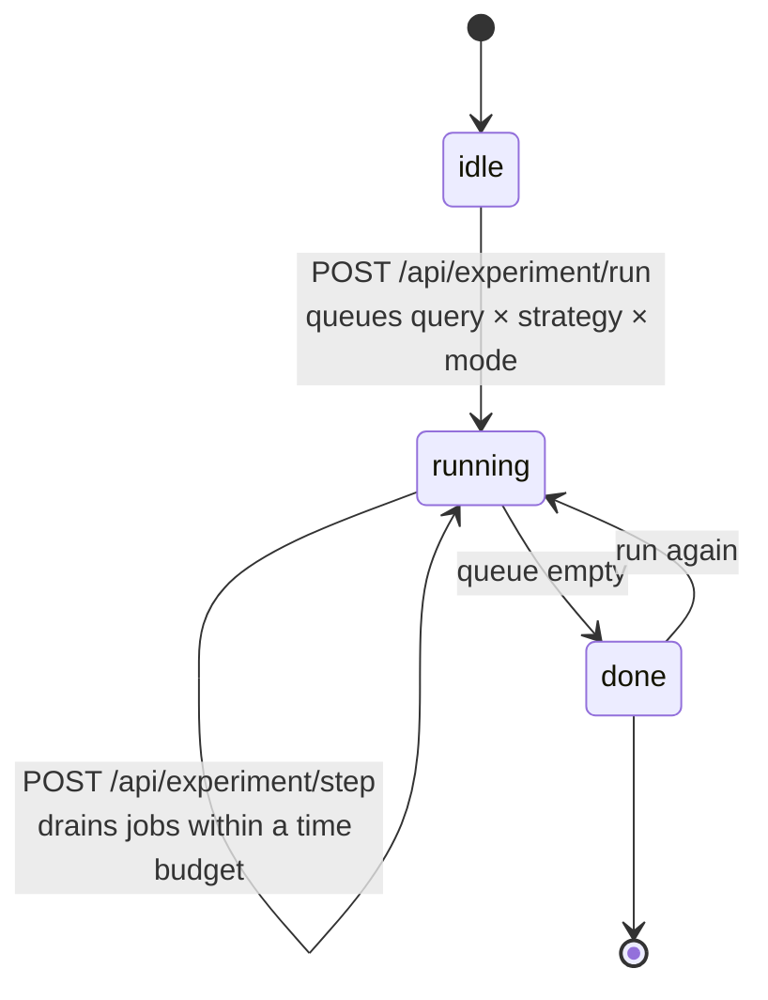

### Why it is split into steps

On a serverless host **a function is frozen the moment it responds**, so a background task started
with `create_task` would never finish. The work therefore has to happen *inside* a request. Each
`POST /api/experiment/step` drains as many jobs as fit in `EXPERIMENT_STEP_SECONDS` (default 50),
persists progress, and returns. The dashboard's poll loop drives it. A Postgres advisory lock stops
two browser tabs running the same jobs twice and doubling the bill.

### Stratified sampling

The query set is stored in complexity order, so a naive `queries[:18]` would return 14 SIMPLE, 4
MEDIUM and **zero** HARD. Every strategy would pick the cheap tier and the comparison would show no
difference at all. `select_queries` allocates seats per band in proportion to the full set using the
largest-remainder method, guaranteeing at least one from every band.

| Subset | SIMPLE | MEDIUM | HARD |
|---|---|---|---|
| Full set (36) | 14 | 12 | 10 |
| Quick run (18) | 7 | 6 | 5 |

---

## 9. The dashboard, tab by tab

Open <http://localhost:8000>. Five tabs down the left. The sidebar footer always shows which models
are configured and warns if no API key is set.

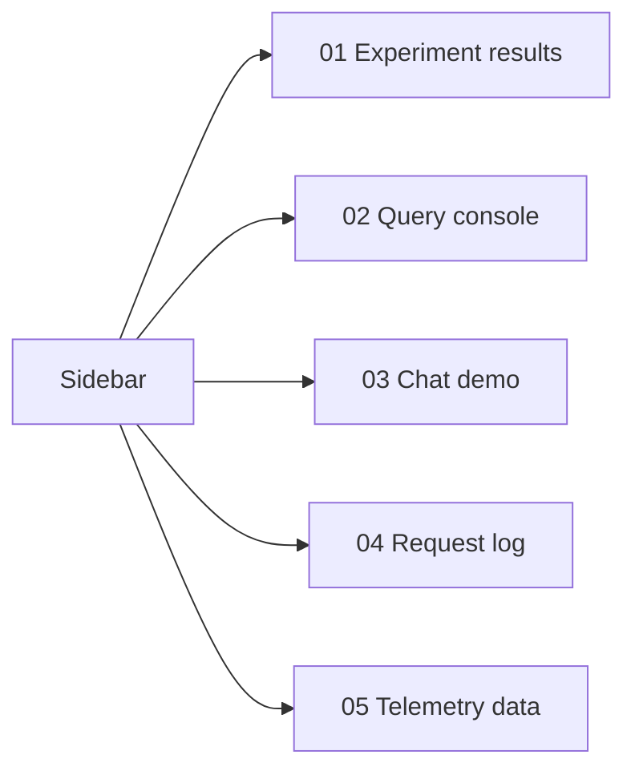

---

### Tab 1 — Experiment results

**What it is for:** the answer to "does routing work". This is the tab to open first and the one to
show a client.

**What to do:** press **Run experiment** (18 questions) or **Full run** (all 36). A progress bar
appears with an estimated time remaining; the page polls until it finishes.

**What you see once it completes:**

| Panel | Reading it |
|---|---|
| **Cost saving hero** | Percentage saved by intelligent routing against the baseline, with the two dollar totals underneath |
| **Quality retained** | Intelligent routing's mean judge score as a percentage of the baseline's. Near 100 means the saving cost nothing measurable |
| **Cost per strategy** | Three bars. Each carries its own quality score and p50/p95 latency underneath, so cost is never shown alone |
| **Model utilization** | What share of requests intelligent routing sent to each tier. This is where the saving comes from |
| **Quality by complexity** | Bar is intelligent routing, tick mark is the premium baseline, on a 0–5 scale, split by SIMPLE / MEDIUM / HARD. If a bar falls well short of its tick on HARD questions, routing is cutting into quality |
| **Quality vs cost** | Scatter plot: each strategy is one point. Further left is cheaper, higher is better |
| **Strategy comparison** | The full table: total cost, cost per request, quality, mean/p50/p95 latency, saving |
| **Context tokens** | How many tokens the pipeline's format saves against dumping raw JSON. A measurement, not a run |
| **Compression A/B** | If the compression experiment has been run, per-strategy cost and quality deltas |

**The judgement to make here:** a strategy that only moves left has bought savings with quality. One
that moves left without moving down has genuinely improved things.

> Provider errors are deliberately not rendered here. They are retried and failed over inside the
> pipeline; a stack trace on screen during a client demo is worse than useless. Only a run that
> mostly collapsed produces one calm line.

---

### Tab 2 — Query console

**What it is for:** understanding a single decision in full detail.

**What to do:**
1. Type a question, or press one of the dashed **simple / medium / hard** buttons to load a sample.
2. Pick a strategy: **No routing**, **Rule-based**, or **Intelligent**.
3. Press **Route**.

**What you see:**

- **Routing decision** — chips for complexity, reasoning, context, quality and latency requirements
  and the selected tier; the router's one-sentence reason; the tier-selection note; and the complete
  response JSON behind a disclosure triangle.
- **Answer** — the model's reply, the model id, and a footer strip with input/output tokens, cost,
  latency, tier and judge score, plus the judge's rationale.

**The thing to try:** ask the *same* question three times, once per strategy, and watch the tier,
cost and quality change while the question does not. That is the whole argument in thirty seconds.

---

### Tab 3 — Chat demo

**What it is for:** the same capability in a form a non-technical audience recognises immediately.

**What to do:** type a question and press Enter (Shift+Enter for a new line), or use the **try
simple / medium / hard** buttons. The strategy selector sits in the header.

**What you see:** each answer is preceded by a **"Router thinking"** block showing the decision
chips, the router's reason, the selection note and the router's own overhead in milliseconds and
dollars. The answer bubble carries the model, tokens, cost, latency and judge score.

**The thing to try:** ask one question, switch strategy, ask it again. The thinking block makes the
difference visible without anyone reading a table.

---

### Tab 4 — Request log

**What it is for:** auditing. Every request ever made, in one table.

**What to do:** filter by strategy with the buttons in the header.

**What you see:** five summary tiles (requests, total cost, mean tokens, mean latency, mean quality)
above a table of request id, question, strategy, model, complexity band, tokens, cost, latency, and
quality as five dots.

**The thing to check:** find a row where the model does not match the strategy's usual tier. That is
a fallback — the routed tier failed and a different one answered. The cost on that row is the tier
that actually answered.

---

### Tab 5 — Telemetry data

**What it is for:** showing that the assistant is answering from real, inspectable data rather than
from the model's own knowledge.

**What to do:** switch between **logs**, **metrics** and **incidents**.

**What you see:** the raw simulated corpus, in tables.

**The thing to notice:** the narrative is genuinely there in the data. An ad-hoc analytics batch job
starts on `db-primary-01` at 10:18, slow queries appear at 10:20:48, `payment-api` times out at
10:21:32, the database hits 200/200 connections at 10:22:40, and the circuit breaker opens at
10:23:15. Meanwhile `inventory-svc` (network) and `search-svc` (memory) fail independently — they are
distractors, and a good answer says so.

---

## 10. Data model

One record per request. Stored as a JSON object in a flat file, or as a `jsonb` column in Postgres.

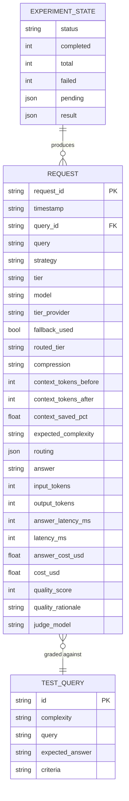

### The fields that carry the argument

| Field | Why it exists |
|---|---|
| `routed_tier` vs `tier` | The router's choice against what actually answered. Their difference is a fallback |
| `answer_cost_usd` vs `cost_usd` | The model call alone, against the model call plus router overhead |
| `context_tokens_before` / `after` | Makes the compression effect measurable per request |
| `compression` | Tags which arm of the A/B a record belongs to, so headline numbers stay compression-free |
| `expected_complexity` | The dataset's own label, used to break quality down by difficulty |

---

## 11. API reference

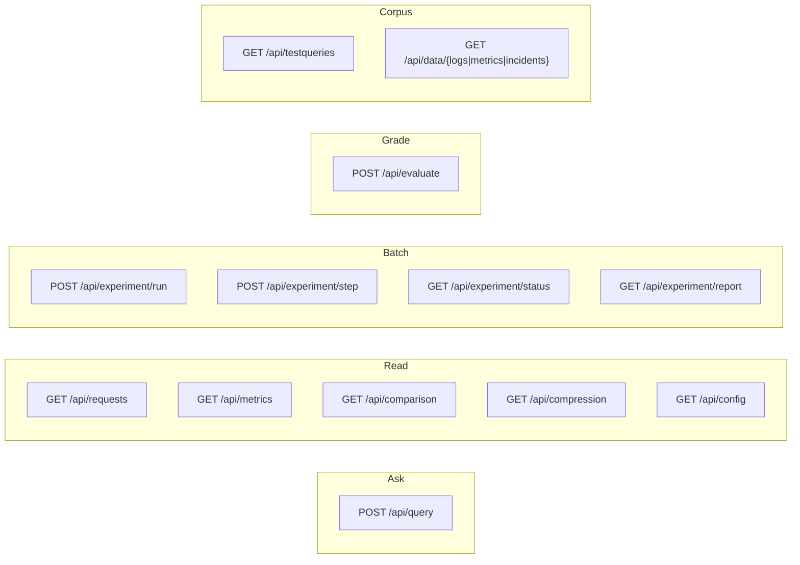

| Endpoint | Purpose |
|---|---|
| `POST /api/query` | `{query, strategy, evaluate}` → answer, routing decision, usage, cost, latency, quality |
| `GET /api/requests` | Request log, optionally filtered by `?strategy=` |
| `GET /api/metrics` | Aggregate metrics plus quality breakdowns |
| `GET /api/comparison` | Per-strategy cost, quality, latency and savings |
| `POST /api/evaluate` | Grade one request, or every ungraded one |
| `POST /api/experiment/run` | Queue the batch (`{full: true}` for all 36; `{compression: "both"}` for the A/B) |
| `POST /api/experiment/step` | Advance the batch by one time-boxed slice and report progress |
| `GET /api/experiment/status` | Progress without doing work |
| `GET /api/experiment/report` | Plain-text comparison report |
| `GET /api/compression` | Naive-JSON reference plus the compression A/B breakdown |
| `GET /api/testqueries`, `GET /api/data/{name}`, `GET /api/config` | Corpus and configuration |

---

## 12. Configuration

### `backend/config/models.yaml`

| Tier | Model | Provider | USD / 1M in | USD / 1M out | Max latency | Context |
|---|---|---|---|---|---|---|
| cheap | `openai/gpt-oss-20b` | Groq | 0.075 | 0.30 | 3,000 ms | 131,072 |
| medium | `openai/gpt-oss-120b` | Groq | 0.15 | 0.60 | 5,000 ms | 131,072 |
| premium | `gpt-4.1` | OpenAI | 2.00 | 8.00 | 10,000 ms | 1,000,000 |
| router + judge | `gpt-4o-mini` | OpenAI | 0.15 | 0.60 | — | — |

Prices verified against Groq's live `/models` endpoint and OpenAI's pricing page on **2026-09-02**.

### Why `reasoning_effort: low` is pinned

The `gpt-oss` models are reasoning models. At their default they spend 170–215 completion tokens on
hidden reasoning before writing anything, which at `max_tokens: 900` truncates the visible answer
mid-sentence or returns an empty string. The judge then grades that truncated text harshly and
quality retention collapses for reasons unrelated to routing.

| Model | Default reasoning tokens | With `low` | Finish reason |
|---|---|---|---|
| gpt-oss-120b | 214 | 32 | `length` → `stop` |
| gpt-oss-20b | 170 | 25 | `stop` → `stop` |

Do not remove it without re-measuring.

### Environment

| Variable | Purpose |
|---|---|
| `GROQ_API_KEY` | cheap and medium tiers |
| `OPENAI_API_KEY` | premium tier, router, judge |
| `DATABASE_URL` | set → Postgres; unset → flat file |
| `DEMO_QUERY_COUNT` | questions in a quick run (default 18) |
| `EXPERIMENT_CONCURRENCY` | parallel provider calls (default **2**) |
| `EXPERIMENT_STEP_SECONDS` | time budget for one batch step (default 50) |

**Groq rate limits matter.** On the free plan the `gpt-oss` models allow 30 requests/min but only
**8,000 tokens per minute**. One answer call carries about 1.7k tokens, so the free plan puts a
roughly 7.7-minute floor on an 18-question run no matter how much concurrency you use — raising it
just collects 429s and back-off waits, making the run *slower*. The Developer plan lifts the ceiling
and the same run finishes in about a minute for roughly $0.02 of Groq tokens.

---

## 13. Deployment

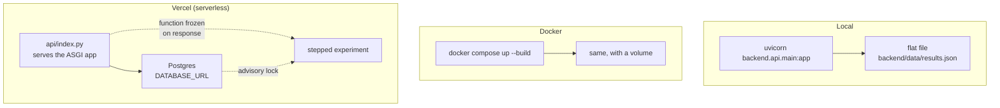

Serverless imposes two constraints the design accommodates:

**No writable disk, no shared memory.** With `DATABASE_URL` set, requests and experiment progress
live in Postgres instead of `results.json` and process globals. Request ids come from a Postgres
sequence so concurrent instances cannot collide.

**A function is frozen once it responds.** Hence the stepped experiment described in section 8.

> The production URL is public by default and spends your OpenAI key on every request. Enable
> Deployment Protection under Project → Settings → Deployment Protection to gate it behind your
> Vercel login.

---

## 14. Testing

```bash
.venv/bin/python -m pytest tests/ -q      # 68 offline tests
```

They run against the flat-file store with a fake LLM client, so neither a database nor an API key is
required.

| File | Covers |
|---|---|
| `test_rule_router.py` | Keyword classification per band, zero router overhead |
| `test_intelligent_router.py` | Decision parsing, tier selection under each constraint, context and latency edge cases |
| `test_cost_and_metrics.py` | Cost formula, tier ordering, percentiles, savings and retention maths, the per-request-not-total regression |
| `test_pipeline_offline.py` | End-to-end for all three strategies, router-failure fallback |
| `test_selection_and_fallback.py` | Stratified selection, fallback chain ordering, blank-answer handling, unconfigured providers |
| `test_context_and_data.py` | Dataset integrity, context determinism |
| `test_compression.py` | The 25.8% context-format claim, compression modes, A/B bookkeeping |

The 25.8% figure is pinned by a test so the documented number cannot drift from the code.

---

## 15. Measured results

### Context format

Measured with the model's own tokenizer (`o200k_base`) across the 18 demo questions:

| Format | Tokens | vs naive JSON |
|---|---|---|
| Naive compact JSON dump | 39,495 | — |
| **Pipeline `key=value` format** | **29,298** | **−25.8%** |
| TOON encoding of the same data | 37,000+ | −5% large / **+18% small** |

TOON was evaluated and rejected: its advantage is uniform tabular JSON, and this pipeline's line
format is already denser.

### Context compression × model tier

Every question × strategy, run once uncompressed and once through a compressor — 108 graded
requests, **2026-09-08**. Context tokens fell 17.6% across the board. Quality did not move uniformly:

| Model | Quality (1–5), compression off → on |
|---|---|
| `gpt-4.1` (premium) | 4.59 → 4.61 (+0.02) |
| `gpt-oss-120b` (medium) | 4.73 → 4.50 (−0.23) |
| `gpt-oss-20b` (cheap) | 4.64 → **3.57 (−1.07)** |

The compressor's only available transform on an already-dense format is a timestamp prefix fold. A
frontier model silently reassembles the folded timestamps; the 20B model misreads them and loses the
incident timeline.

**The damage is not distributed by question difficulty — HARD questions barely moved. It is
distributed by which model reads the folded context.** And routing sends the highest volume of
traffic to precisely the weakest model. The two levers are sold as independent and multiplicative;
measured together on the same corpus, one destroys the other.

**The resolution is a policy, not a switch:** compress for the medium and premium tiers, send the
cheap tier the original. On this data that preserves the saving and removes the quality damage
entirely. This finding is what version 2 was built around.

---

## 16. Known limitations

Stated plainly, because a reviewer will find them anyway.

| Limitation | Detail |
|---|---|
| **Small sample** | An 18-question run is a point estimate with no error bar. Bootstrapping the per-request costs would give a 95% interval |
| **`quality_retention_pct` is a ratio of means on an ordinal scale** | Defensible as a headline, weak under scrutiny. Percentage of requests scoring ≥4, and win/tie/loss counts, would be robust companions |
| **Judge cost is excluded from `cost_usd`** | Defensible — it is offline evaluation, not serving cost — but it should be said out loud rather than discovered |
| **Ground-truth judging does not transfer** | Real client traffic has no expected answers. A pairwise judge and a groundedness-only judge would be needed |
| **No caching** | The largest missing lever and the cheapest to add |
| **The router is an LLM call on every request** | It can erase the savings it creates. It should be distilled into a classifier trained on its own logged decisions |
| **No budget, policy, or tenancy** | Deliberately deferred until the routing economics were proven |
| **Single-tenant, no authentication** | The deployed URL spends the owner's key for anyone who reaches it |

Every item on this list is addressed in version 2.

---

*All figures are measurements of a synthetic IT-operations workload run against real provider APIs at
real published prices. Prices should be re-verified against provider pricing pages before any figure
is quoted.*
