# AI Inference Cost Optimizer — Architecture and User Guide

**Version:** 2.0
**Component:** A provider-neutral control plane for AI inference cost
**Predecessor:** [v1 — LLM Routing POC](./ARCHITECTURE-v1.md)
**Audience:** engineers, reviewers, and anyone opening the dashboard for the first time

---

## Contents

1. [What changed, and why](#1-what-changed-and-why)
2. [What the system does](#2-what-the-system-does)
3. [Use cases](#3-use-cases)
4. [System architecture](#4-system-architecture)
5. [The request pipeline](#5-the-request-pipeline)
6. [The decision ladder](#6-the-decision-ladder)
7. [Each optimization layer](#7-each-optimization-layer)
8. [Two measured findings that shaped the design](#8-two-measured-findings-that-shaped-the-design)
9. [Cost, baselines and attribution](#9-cost-baselines-and-attribution)
10. [The quality gate](#10-the-quality-gate)
11. [Policy, budget and tenancy](#11-policy-budget-and-tenancy)
12. [The dashboard, page by page](#12-the-dashboard-page-by-page)
13. [Demo scenarios](#13-demo-scenarios)
14. [Data model](#14-data-model)
15. [API reference](#15-api-reference)
16. [Configuration](#16-configuration)
17. [Testing](#17-testing)
18. [Deployment](#18-deployment)
19. [How honesty is enforced](#19-how-honesty-is-enforced)
20. [What is deliberately not built](#20-what-is-deliberately-not-built)

> **Diagrams.** Every diagram is [Mermaid](https://mermaid.js.org/), which GitHub renders inline. To
> edit one visually, open [draw.io](https://app.diagrams.net) → **Arrange → Insert → Advanced →
> Mermaid** and paste the block.

---

## 1. What changed, and why

Version 1 proved that routing saves money without costing quality. It also had a limitations section,
and version 2 is that section, addressed.

| v1 | v2 |
|---|---|
| Routing only | Nine optimization layers, each measured separately |
| An LLM call on every routed request | A four-rung decision ladder; the paid rung fires only when the free ones are unsure |
| No caching | Exact cache and semantic cache with deterministic subject guards |
| Cost per token | **Cost per successfully completed task** |
| A `reason` string | A full stage-by-stage trace, including the candidates the router rejected and why |
| One "we saved X%" number | A savings waterfall that reconciles bar by bar to the ledger |
| LLM judge on everything | Deterministic validators first; the judge only where no contract exists |
| Single tenant, no auth | Tenants, applications, virtual API keys, policy precedence, budgets |
| Compress-or-not | Tier-aware compression, because compression is model-dependent |
| Five dashboard tabs | Fourteen pages, including presentation mode and shadow mode |
| 68 tests | 181 tests, fully offline |

The one-line difference: **v1 answered "does routing work?". v2 answers "why did this request cost
what it cost, and can I trust that number?"**

---

## 2. What the system does

For every request, in order:

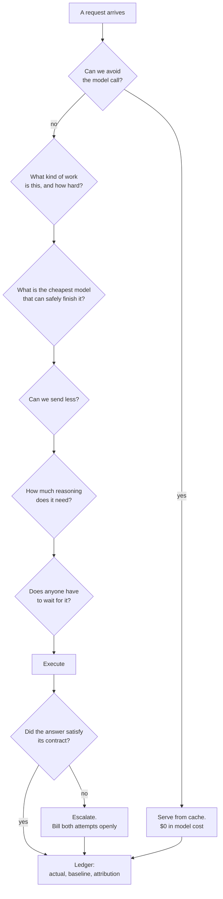

It is **not** another LLM gateway and **not** another router. The differentiator is the decision and
measurement layer: what was considered, what was rejected, what it cost, what it would have cost, and
how much of that comparison is measured rather than assumed.

**Measured on the shipped demo workload against real providers: 53–72% saved at a 100% quality-gate
pass rate.** That is a measurement of a synthetic IT-operations workload, not a forecast of anyone
else's — which is precisely what shadow mode exists to replace.

---

## 3. Use cases

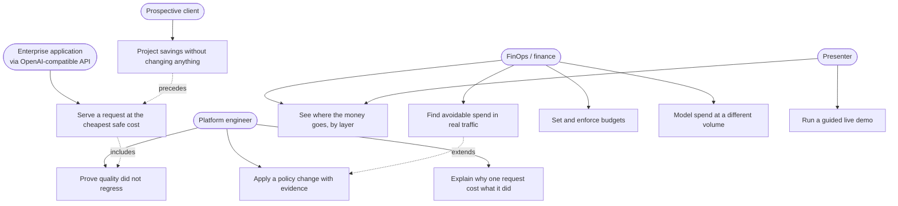

### The adoption path this supports

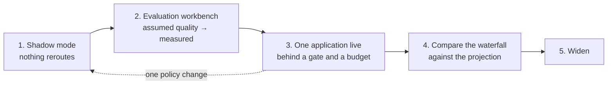

Step 3 is the first that touches a production request, and every step is reversible with one policy
change.

---

## 4. System architecture

A modular monolith. Separate services would add operational cost without buying anything here.

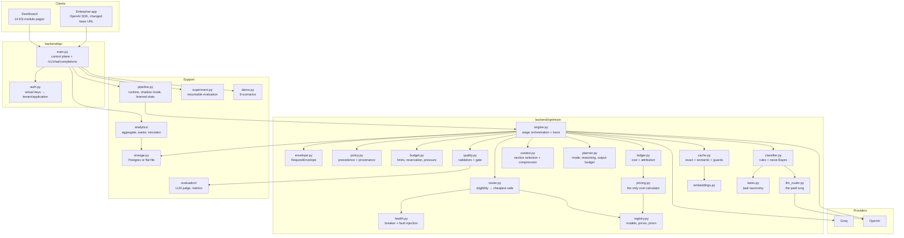

### Module responsibilities

| Module | Owns |
|---|---|
| `envelope.py` | The one request shape every entry point normalises into |
| `registry.py` | Models: prices, capabilities, quality priors **and their sources** |
| `pricing.py` | The only place tokens become dollars |
| `policy.py` | Resolution across four layers, with provenance for every value |
| `budget.py` | Soft and hard limits, reservation, reconciliation, pressure |
| `tasks.py` | Task taxonomy — adding a task type is a data change, not a router change |
| `classifier.py` | Free rungs: regex rules plus a local naive-Bayes model |
| `llm_router.py` | The paid rung, gated on a confidence threshold |
| `cache.py` | Both caches, the subject guards, and the separation measurement |
| `context.py` | Task-aware section selection and tier-aware compression |
| `router.py` | Eligibility, expected cost/quality/latency, the explainable choice |
| `planner.py` | Execution mode, reasoning level, output budget |
| `quality.py` | Deterministic validators and the gate decision |
| `health.py` | Provider health, circuit breaker, fault injection |
| `ledger.py` | Cost ledger and non-overlapping savings attribution |
| `engine.py` | Stage orchestration; every stage appends a trace step |

---

## 5. The request pipeline

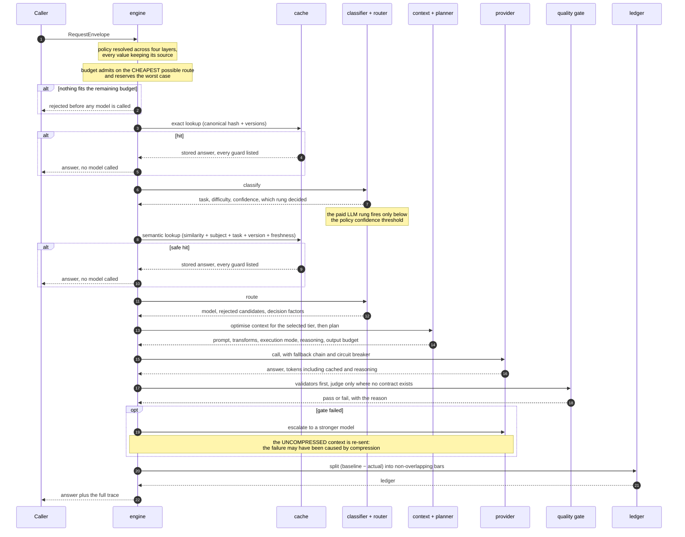

### Three ordering decisions, each forced by measurement

**Routing runs before context optimisation.** Compression is model-dependent (§8), so the context
stage must know which tier will read the result. The router therefore sees, and the context-window
constraint uses, the *uncompressed* token count.

**The semantic cache runs after classification.** Similarity alone is not answer equivalence; the
guard needs to know what kind of question this is.

**Cache lookups key on the uncompressed canonical request.** A hit must never depend on which
compression policy happened to be active when the entry was written.

---

## 6. The decision ladder

The router must not cost more than it saves.

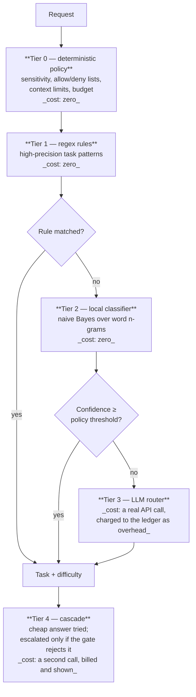

The local classifier reports **leave-one-out accuracy** — each labelled query predicted by a model
trained without it, not training accuracy:

| Metric | Value |
|---|---|
| Task type | 93.1% |
| Difficulty | 84.5% |

The LLM router's own logged decisions can be distilled back into the free rung from the evaluation
workbench, which is the closed-loop learning path.

---

## 7. Each optimization layer

```mermaid
flowchart LR
    B["Baseline spend<br/>everything on the frontier model"]
    B --> L1["Exact cache<br/>model call avoided"]
    L1 --> L2["Semantic cache<br/>model call avoided"]
    L2 --> L3["Context optimisation<br/>fewer input tokens"]
    L3 --> L4["Model routing<br/>cheaper model, same prompt"]
    L4 --> L5["Provider prompt cache<br/>cached input rate"]
    L5 --> L6["Reasoning optimisation<br/>fewer hidden tokens"]
    L6 --> L7["Execution mode<br/>batch discount"]
    L7 --> N1["− Optimizer overhead<br/>router + embeddings"]
    N1 --> N2["− Escalations<br/>rejected attempts"]
    N2 --> N3["− Fallbacks<br/>failed attempts"]
    N3 --> F["Actual spend"]
```

| Layer | What it does | How it is priced |
|---|---|---|
| **Exact cache** | SHA-256 of the canonical request plus prompt, knowledge and policy version. Tenant- and application-namespaced | The whole baseline avoided |
| **Semantic cache** | Embedding similarity **and** same entities **and** same aspect **and** same task type **and** same versions **and** freshness **and** the stored answer passed its own gate | The whole baseline avoided |
| **Context optimisation** | Keeps only the corpus sections the task type reads; dedupes; collapses whitespace; compresses only where tier-safe | Frontier input rate × tokens removed |
| **Model routing** | Cheapest model meeting quality, latency, cost, capability and policy constraints | Frontier on the same prompt, minus the selected model at list price |
| **Provider prompt cache** | Static context first, question last, so the provider's own prefix cache can match | List price minus cached rate |
| **Reasoning optimisation** | Reasoning level as a policy dimension, not a model default | Registry's measured reasoning-token counts (labelled *estimated*) |
| **Execution mode** | interactive / near-real-time / batch / offline from the SLA class | Published batch discount (labelled *modeled*) |

Layers below the line are costs, shown as negative bars rather than netted away.

---

## 8. Two measured findings that shaped the design

Both are results from this repository, both contradict how the market sells the lever, and both are
why the architecture is shaped the way it is.

### Finding 1 — Compression and cheap-tier routing interact destructively

108 graded requests, 2026-09-08. Every query × strategy, once uncompressed and once compressed.
Context tokens fell 17.6% across the board. Quality did not move uniformly:

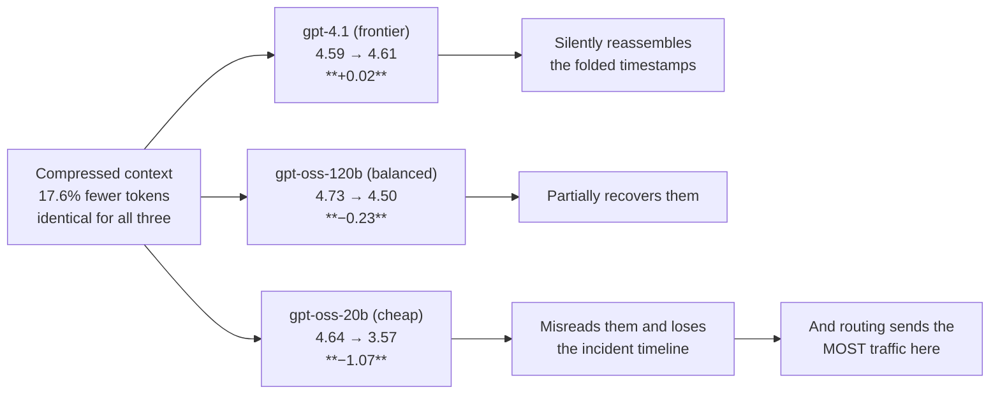

| Model | Off → on | Delta |
|---|---|---|
| `gpt-4.1` (frontier) | 4.59 → 4.61 | +0.02 |
| `gpt-oss-120b` (balanced) | 4.73 → 4.50 | −0.23 |
| `gpt-oss-20b` (cheap) | 4.64 → **3.57** | **−1.07** |

The compressor's only transform on an already-dense format is a timestamp prefix fold. A frontier
model silently reassembles the folded timestamps; the 20B model misreads them and loses the incident
timeline.

**The damage tracks which model reads the context, not how hard the question is** — and routing sends
the most traffic to precisely the weakest model.

**Resolution:** a policy, not a switch. `compression.mode: tier_aware` compresses for the balanced
and frontier tiers and sends the cheap tier the original. It is also why the context stage runs
*after* routing.

### Finding 2 — Embedding similarity alone cannot make a semantic cache safe

Measured on this corpus with the local lexical embedder:

| | Similarity |
|---|---|
| Worst true paraphrase | 0.277 |
| Best distractor (a genuinely different question) | 0.787 |
| Best distractor **after subject guards** | 0.157 |

"The current CPU usage of payment-api" scores **0.73** against "the current CPU usage of auth-svc"
but only **0.38** against its own paraphrase. Any threshold that serves the paraphrase also serves
the wrong service's number.

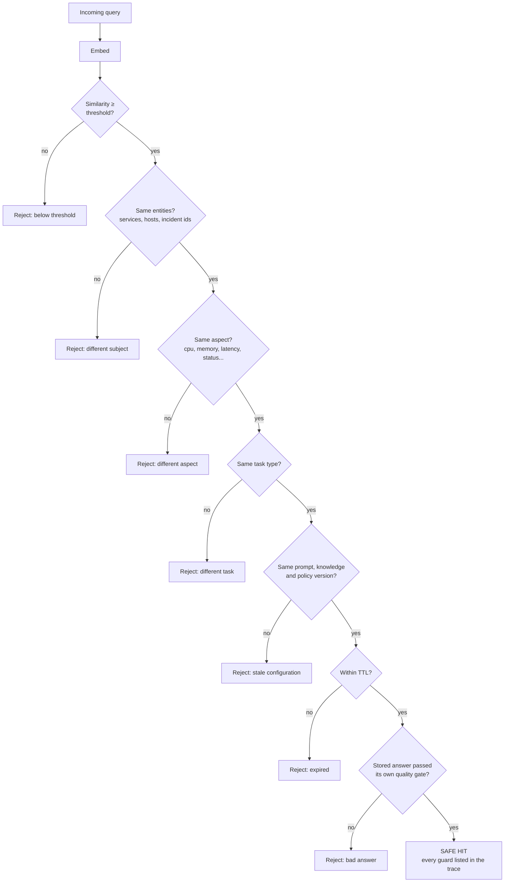

The guards remove 79 of 83 distractors and make the corpus separable. Rejected candidates and the
failing guard appear in the trace, and the separation measurement is on the cache page — nobody has
to take the threshold on trust.

---

## 9. Cost, baselines and attribution

### Every figure carries its basis

| Basis | Meaning |
|---|---|
| `measured` | Computed from token counts the provider actually returned |
| `calibrated` | Estimated from the price registry, then corrected by the ratio observed on real frontier runs |
| `estimated` | From the price registry, with no real comparison run yet |
| `modeled` | A published rate applied to a scenario this system did not execute |

### Why baselines are calibrated rather than substituted

In production you cannot run the baseline and the optimised path side by side without doubling the
bill, so the baseline is reconstructed per request.

The obvious approach — use a real frontier run's dollar cost when one exists — measures *worse*. Two
runs of the same question on the same model differ mainly in how long the answer happens to be, so a
single request can show a **negative saving** for a reason unconnected to the optimizer. This was
observed in a live run and the design changed.

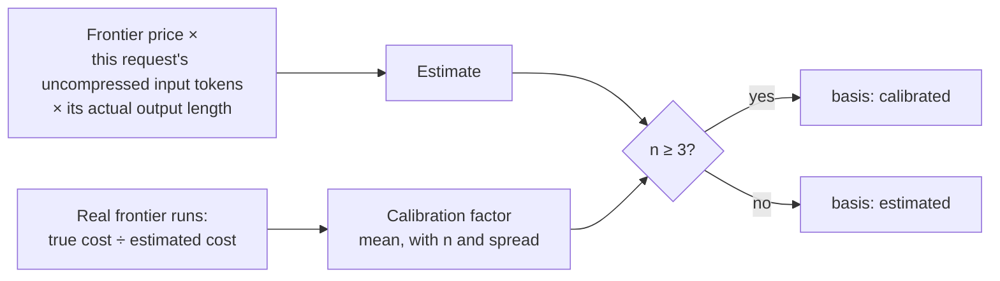

### The waterfall reconciles by construction

Bars are summed from per-request ledger rows, and the serving cost decomposes in three
non-overlapping steps so no saving is counted twice:

```
frontier on the same prompt
  − selected model at list price      → model routing
  − provider prefix-cache discount    → provider prompt cache
  − execution-mode discount           → execution mode
```

The UI shows whether the residual is zero. A test asserts it. An earlier version had the
provider-cache bar as a zero placeholder that silently absorbed the residual while its own text said
it contributed nothing — that is exactly the kind of drift this structure prevents.

---

## 10. The quality gate

Deterministic checks run first and cost nothing. The LLM judge runs only where no contract exists.

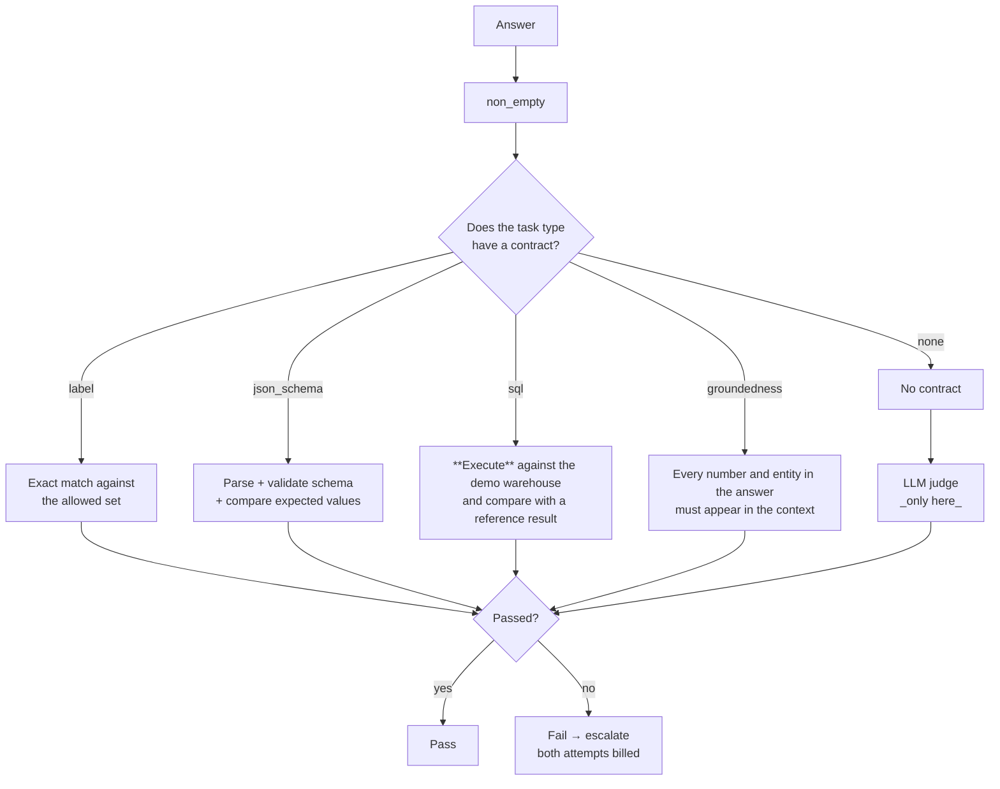

| Validator | What it actually does |
|---|---|
| `label` | Normalises and matches one allowed label; refuses an answer containing two |
| `json_schema` | Parses, validates against the declared schema, then compares expected field values |
| `sql` | Loads the corpus into SQLite, **executes** the generated query, compares result rows with a reference query. Refuses anything that is not a read-only SELECT |
| `groundedness` | Extracts numbers and entity names from the answer and requires each to appear in the context. A model that invents a figure fails |

A failed deterministic validator always fails the gate: it is a contract, not an opinion. Judge calls
are excluded from serving cost, and the page says so.

---

## 11. Policy, budget and tenancy

### Policy precedence

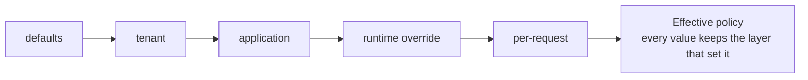

An unknown key is **reported**, not silently ignored, so a typo in a policy file is visible. Feature
flags follow their own chain: policy file < `FLAG_<NAME>` environment variable < runtime override.

### Budget admission

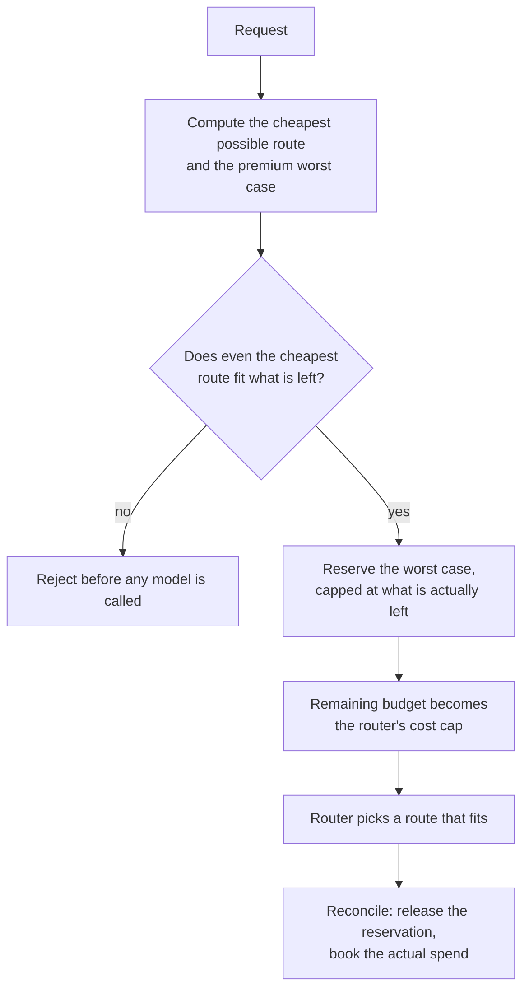

An earlier version reserved the premium worst case and rejected against it, which turned every budget
squeeze into an outage while a cheap route was still affordable. Admission now tests the floor, and
pressure reaches the router as a tightened cost cap.

**Quality is never relaxed for money by default.** What pressure changes is which of the
already-acceptable routes is chosen.

### Tenancy

Virtual API keys map to a tenant and an application: `OPTIMIZER_KEY_<NAME>=secret:tenant:application`.
Cache namespaces, budget scopes, policy resolution and the request log are all tenant-scoped, and
isolation has tests. A tenant key cannot act for another application or change policy; the admin key
can.

---

## 12. The dashboard, page by page

Open <http://localhost:8000>. Fourteen pages in four groups. No build step: plain ES modules.

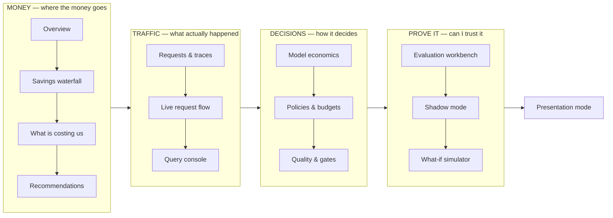

**If you are opening this for the first time:** go to **Overview**, press **Run demo workload**, wait
about forty seconds, then read down the page. Or press **Presentation mode** for a guided tour that
runs everything live.

---

### Overview — *"What is our AI costing, and why?"*

The page to open first and the one to show a client.

**What to do:** press **Run demo workload**. It runs the baseline, optimized and cache scenarios
against real providers.

| Panel | How to read it |
|---|---|
| **Savings vs always-frontier** | The headline, with both dollar totals and the request count underneath |
| **Cost per successful task** | Total spend ÷ requests that passed their quality gate. This is the unit that matters, not cost per token |
| **Quality** | Mean judge score and the gate pass rate |
| **P95 latency** | With p50 and the cache hit rate |
| **Spend as the workload runs** | Two cumulative lines: what it cost, against what the same traffic would have cost on the frontier model. The gap is the product |
| **Where the traffic went** | Model mix, with frontier share, escalation and fallback rates |
| **Savings by layer** | A preview of the waterfall |
| **Cost against quality** | One point per strategy. Further left is cheaper, higher is better |
| **Cache** | Hit rates **and dollars saved separately**, plus the separation measurement |
| **Strategy comparison** | The full table, including cost per solved task |
| **Budget** | Pressure bars per scope, if limits are configured |

**The judgement to make:** a strategy that only moves left has bought savings with quality. One that
moves left without moving down has advanced the frontier.

---

### Savings waterfall — *"Where did the savings come from?"*

**What to do:** read left to right.

Green bars are money kept, red bars are money the optimizer spent to keep it. The chart starts at the
baseline and ends at actual spend.

**The tile to check first is "Reconciles".** It says whether the bars sum exactly to the saving. They
are summed from per-request ledger rows, so the chart is an aggregation of measured rows rather than
a separate calculation that could drift.

The table below explains each bar and, in the **Basis** column, states whether it is measured,
calibrated, estimated or modelled. The final card explains how baselines are decided and why they are
calibrated rather than substituted.

---

### What is costing us — *"What spend is avoidable?"*

Waste findings derived from **your** traffic. If a pattern did not occur, it is not on this page —
this is not a generic best-practice list.

Each finding carries its severity, the evidence it rests on, the number of observations, and whether
that is enough to be confident. Findings with fewer than three observations are marked **low
confidence** and should be read as hypotheses.

Patterns detected: frontier models on easy work, repeated identical requests, semantic near-misses,
unused output budget, unoptimised context, provider fallbacks, quality escalations, router overhead
as a share of savings, batch-eligible traffic running interactively, and no provider prefix-cache
reuse on eligible requests.

---

### Recommendations — *"What should we change?"*

Each recommendation carries the projected saving, the **measured quality evidence for or against it**,
a confidence rating, and the exact policy patch it would apply.

**Read the quality evidence before the saving.** A recommendation whose alternative model has never
been graded on that task says so and is not safe to apply — the button still works, but it is
labelled *Apply anyway*.

Nothing is applied automatically. The learning loop proposes; a human approves.

---

### Requests & traces — *"Why did this request cost that much?"*

Every request in one table. **Click any row** for the full trace.

The trace drawer shows, stage by stage:

| Stage | What it reveals |
|---|---|
| Policy | Every resolved value **and the layer that set it** |
| Budget | Limits, pressure, what was reserved |
| Exact cache | Hit with every guard listed, or the closest rejection and why |
| Classify | Task, difficulty, which rung decided, confidence, runners-up |
| Semantic cache | Guards passed, or **every rejected candidate with the failing guard** |
| Route | The factors, then a table of every candidate: estimated cost, quality, latency, the source of each estimate, and for excluded models the constraint that removed them |
| Context | Sections kept and dropped, each transform with before/after tokens, and the cacheable prefix size |
| Plan | Execution mode, reasoning level, output budget, with reasons |
| Execute | Model, tokens including cached and reasoning, and every attempt if there was a fallback |
| Quality | Each validator with its verdict and detail; the judge only if it ran |
| Escalate | What triggered it and what happened |
| Ledger | The attribution bars with their bases |

**This is the screen that answers a sceptical architect.**

---

### Live request flow — *"Show me the architecture working"*

Send one question and watch each of the twelve stages light up with what it actually decided. Click
any stage for the full trace.

**The thing to try:** ask the same question twice. The second time, the cache intercepts it before the
router is ever consulted, and the later stages grey out.

---

### Query console — *"Ask, and see the decision before the answer"*

A conversation view. Each answer is preceded by the routing decision and followed by cost, saving,
latency and quality.

**The thing to try:** switch strategy in the header and ask the same question again. Same question,
different model, visibly different cost.

---

### Model economics — *"What is each model worth?"*

Prices, capabilities, context windows and measured latency, plus a cost-versus-quality scatter.

**The important column is quality by difficulty.** Green chips are measurements from graded requests;
**amber chips are assumed priors nobody has verified on this workload**. Because
`allow_unmeasured_models` is false by default, an amber cell keeps that model out of the routing
decision entirely. The router refuses to guess.

Providers are listed with whether they publish prompt caching and batch discounts — claimed only
where the provider actually publishes them.

---

### Policies & budgets — *"Who may spend what, on which models?"*

Feature flags at the top: twelve switches, each turning one optimizer capability off at runtime.
**Turning one off and re-running the workload is the fastest way to show what that layer was
contributing.**

Below, pick an application to see its effective policy with the layer that set each value, and its
budget with live pressure. Set a daily limit below current spend to watch routing adapt and then
reject.

Provider health at the bottom, with **Break Groq** / **Break OpenAI** buttons that inject a real fault
into the real client — so the failover you then demonstrate is the actual code path.

---

### Quality & gates — *"Is the quality safe?"*

Gate pass rate, which validators ran and how they fared, quality by model and by task, and the score
distribution.

**The two tables at the bottom are the point:** every request the gate rejected, and every
escalation with its extra cost. These are the reason the savings can be trusted — the system found
them, not the client.

The router's leave-one-out accuracy is at the foot of the page.

---

### Evaluation workbench — *"Prove it on a dataset I can inspect"*

Run the query set through any combination of the four strategies. Every answer is graded the same
way. A run clears the request log, caches and budget counters first so each evaluation starts from
the same state.

This is where an **assumed** quality prior becomes a **measured** one, and where a routing change is
checked before it reaches a client.

The compression × tier finding is documented at the foot of the page with the measured table.

---

### Shadow mode — *"Show me the saving before I change anything"*

Production keeps calling the model it uses today. The optimizer watches the same traffic, decides
what it *would* have done, and prices that from the registry using the incumbent's own token counts.

**No production request is rerouted.** Every figure is labelled `estimated`, and the page carries the
five-step adoption path.

---

### What-if simulator — *"What would this cost at our volume?"*

Two tabs.

**What-if:** requests per month, token sizes, cache hit rate, context reduction, batch share and model
mix. Each lever's contribution is computed by turning it off on its own, so overlapping effects are
not double-counted. Defaults are seeded from traffic this system actually recorded.

**Build vs buy:** fully loaded self-hosting cost against the equivalent API bill — GPU hours,
utilisation, redundancy, storage, egress, observability and **engineering and on-call**, which is the
line item most build/buy cases omit and the one that decides the answer. It reports the break-even
volume and refuses to recommend self-hosting below it.

Everything on this page is labelled `modeled`. It is a sensitivity scenario, not a promise.

---

### Presentation mode — *"Run the client demo"*

Eleven guided beats. Arrow keys or the bar at the bottom to navigate. Each beat runs **real requests
live** when you press the button.

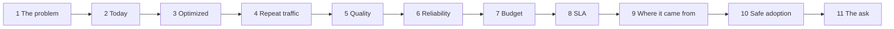

**Reset demo** clears the request log, caches and budgets so the sequence can be run again from
scratch.

---

## 13. Demo scenarios

Each runs real requests through the real pipeline and reports what actually happened. **If a scenario
cannot make its point on a given run, it says so rather than pretending.**

| Scenario | Demonstrates | Guarded against |
|---|---|---|
| `baseline` | The number to beat | — |
| `optimized` | The same questions, routed on need | Asserts more than one model was used |
| `cache` | Exact hit, semantic hit, **and a near-miss correctly refused** | Asserts the wrong-service question is *not* served |
| `escalation` | A contract failure escalating, both attempts billed | Two stages, so it works whichever way the models behave |
| `failover` | An injected outage absorbed | Asserts a different provider answered and the fault reached the client |
| `budget` | Pressure changing the route, then a hard rejection | Asserts quality was not traded away |
| `sla` | The same work moving to the batch lane | Asserts the batch application did not quietly run interactively |
| `shadow` | Production untouched while the optimizer reports | Asserts the incumbent served every answer |

Scenarios that demonstrate routing, failover or budget clear the cache first. An earlier version had
three of them silently short-circuited by cache hits from previous scenarios — the failover demo was
"answered by exact-cache" and proved nothing. `tests/test_scenarios.py` now asserts each one
exercises its mechanism.

---

## 14. Data model

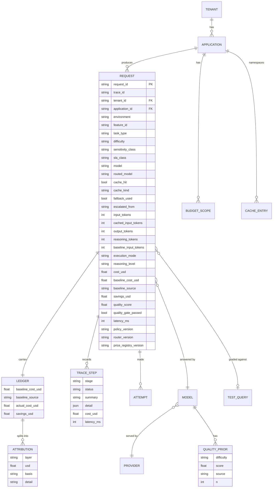

Multi-tenancy is in the domain model from the start. Every version — policy, router and price
registry — travels with every record, so a configuration change never silently rewrites history.

---

## 15. API reference

### OpenAI-compatible endpoint

An application changes its base URL and keeps its code.

```bash
curl localhost:8000/v1/chat/completions -H 'content-type: application/json' -d '{
  "model": "gpt-4.1",
  "messages": [{"role": "user", "content": "Is auth-svc currently healthy?"}],
  "optimizer": {"sla_class": "interactive", "quality_target": 4.0}
}'
```

The response is a standard chat completion plus an `optimizer` block: selected model, reason, cost,
baseline, quality verdict and a `trace_url`. The same facts appear on the `x-optimizer-request-id`,
`x-optimizer-model` and `x-optimizer-cost-usd` headers.

### Control plane

| Group | Endpoints |
|---|---|
| Requests | `POST /api/query`, `GET /api/requests`, `GET /api/requests/{id}` |
| Analytics | `GET /api/analytics/{overview,waterfall,routing,cache,quality,unit-economics,waste,recommendations,shadow}` |
| Registry | `GET /api/models`, `GET /api/tasks` |
| Control | `GET/PUT /api/policies`, `GET/PUT /api/flags`, `GET/PUT /api/budgets` |
| Simulation | `POST /api/simulate`, `POST /api/simulate/build-vs-buy`, `GET /api/simulate/defaults` |
| Evaluation | `POST /api/experiment/{run,step}`, `GET /api/experiment/{status,report}` |
| Learning | `GET /api/classifier`, `POST /api/classifier/retrain` |
| Demo | `POST /api/demo/scenario/{key}`, `POST /api/demo/chaos`, `POST /api/demo/reset` |

---

## 16. Configuration

### `backend/config/models.yaml` — model and price registry

Versioned (`price_registry_version`) and dated (`effective_date`); both travel with every ledger
record. Per model: prices including cached-input rates, context window, capabilities, measured
latency profile, reasoning-token measurements, and **quality priors per difficulty with their source
and sample size**.

`backend/optimizer/pricing.py` is the only place tokens become dollars.

| Tier | Model | Provider | USD / 1M in / out |
|---|---|---|---|
| cheap | `openai/gpt-oss-20b` | Groq | 0.075 / 0.30 |
| balanced | `openai/gpt-oss-120b` | Groq | 0.15 / 0.60 |
| balanced (alt) | `gpt-4.1-mini` | OpenAI | 0.40 / 1.60 (cached in 0.10) |
| frontier | `gpt-4.1` | OpenAI | 2.00 / 8.00 (cached in 0.50) |

### `backend/config/policies.yaml` — policy and feature flags

Defaults, tenants, applications and twelve feature flags. Two demo tenants (`acme`, `globex`) with
four applications between them covering interactive, batch and confidential workloads.

### Output budgets must include hidden reasoning

A 20-token classification budget was smaller than the gpt-oss models' hidden reasoning. The call
returned empty, was correctly treated as a failure, and failed over to the frontier model — **costing
more than not capping the output at all.** The planner now adds headroom from the registry's measured
reasoning-token counts. A test pins this.

---

## 17. Testing

```bash
.venv/bin/python -m pytest tests/ -q      # 181 tests, ~2.5 seconds, no network
```

| File | Covers |
|---|---|
| `test_registry_and_pricing.py` | Price components, cached input, batch discounts, versioning, **attribution bars sum exactly and do not overlap** |
| `test_policy_and_budget.py` | Precedence and provenance, sensitivity, flags, envelope, budget admission and reservation, **request-id uniqueness under concurrency** |
| `test_classifier_and_quality.py` | Classifier ladder, honest accuracy, every validator, gate decisions, **output budget covers hidden reasoning** |
| `test_cache_and_health.py` | Cache guards, tenant isolation, semantic accept/reject reasons, circuit breaker, chaos |
| `test_pipeline_offline.py` | End-to-end per strategy, trace completeness, ledger reconciliation, cache, fallback, escalation, shadow |
| `test_scenarios.py` | **Each demo scenario actually demonstrates its point** |
| `test_api.py` | Every endpoint, tenant isolation, the OpenAI endpoint, simulators, legacy records |
| v1 suites | All original invariants preserved |

An autouse fixture makes constructing a real provider client **raise**, because the FastAPI lifespan
builds one from `.env` and a test that started the app would otherwise spend real provider credit.
That is not hypothetical — it happened during development and cost $0.44 before it was caught.

---

## 18. Deployment

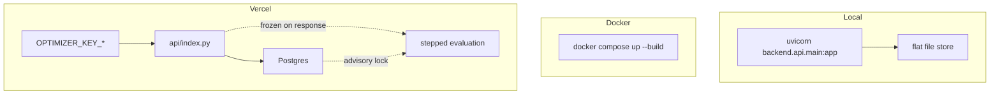

**Set at least one `OPTIMIZER_KEY_*` on a public deployment.** Without it the instance is open and
spends your provider credit on every request — and `/api/config` and the sidebar both say so rather
than implying the deployment is secured.

---

## 19. How honesty is enforced

Mechanical rules, not aspirations. This is a product for a conversation where the client's first
instinct is disbelief.

| Rule | Enforcement |
|---|---|
| Every cost figure carries its basis | Four bases, shown as chips with tooltips |
| The waterfall reconciles | Bars summed from ledger rows; residual displayed; test asserts it |
| Baselines are calibrated, never substituted | Removes output-length variance; factor reported with n and spread |
| The router refuses to guess | Unmeasured quality → ineligible unless policy allows |
| Quality never inferred from cost | Deterministic validators first; judge cost excluded and stated |
| An unsecured instance says so | `/api/config` and the sidebar |
| Pre-ledger records set aside | Excluded from cost math, count shown |
| Classifier reports leave-one-out accuracy | Not training accuracy |
| Scenarios report honest outcomes | Including "the route did not change, and here is why" |

---

## 20. What is deliberately not built

Judgment calls worth stating rather than leaving as gaps.

**No separate gateway process.** LiteLLM or Bifrost would add real value at multi-tenant scale, and
the provider abstraction is deliberately thin enough to swap in. At this stage it adds an operational
hop without buying anything.

**No autonomous policy updates.** The learning loop proposes a policy patch with its evidence and a
confidence rating; a human approves it. A router that retrains and redeploys itself against a quality
gate it also owns is not a feature.

**No self-hosting recommendation.** The calculator exists to show that self-hosting is usually *not*
cheaper at POC volume, and reports the break-even volume rather than arguing a case.

**Batch execution is priced, not performed.** The planner selects the lane and applies the published
discount; every figure depending on it is labelled `modeled`.

**The local embedder is lexical, and says so.** With no OpenAI key the semantic cache falls back to
bag-of-words vectors — a materially weaker signal, which is why the subject guards carry the safety
and the separation measurement is on screen.

---

*All figures are measurements of a synthetic IT-operations workload run against real provider APIs at
real published prices. They are a measurement of that workload, not a forecast of yours — which is
what shadow mode and the evaluation workbench are for.*
